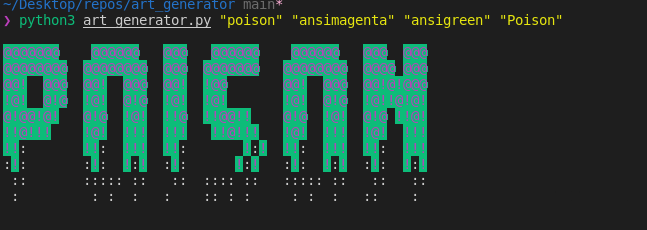

# Art Generator

Fun command line app to make word art using figlet

## Usage

```zsh
export FONT="poison"
export TEXT_COLOR="ansimagenta"
export BG_COLOR="ansigreen"
export PAYLOAD="Poison"

python3 art_generator.py $FONT $TEXT_COLOR $BG_COLOR $PAYLOAD

python3 art_generator.py "poison" "ansimagenta" "ansigreen" "Poison"
```

